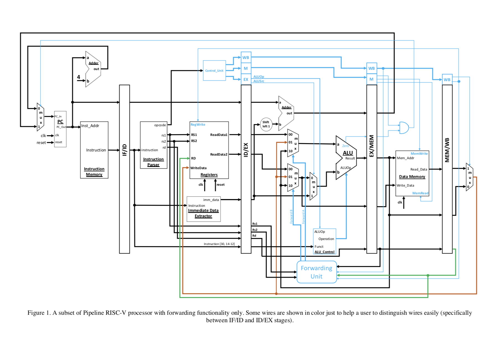

# PipelinedRISCProcessor
Implementation of the orginal pipelined version of a RISC-V processor

The pipeline implementation of a RISC-V processor with data forwarding techniques to overcome data hazards.

For further reading please refer to http://home.ustc.edu.cn/~louwenqi/reference_books_tools/Computer%20Organization%20and%20Design%20RISC-V%20edition.pdf

